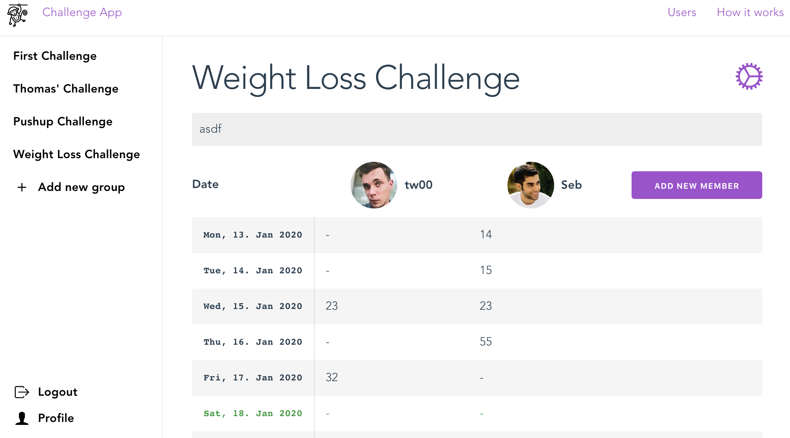

# heliosRX example project: Fitness Tracker

## Demo

- [https://heliosrx-example-tracker.web.app/](https://heliosrx-example-tracker.web.app/)



## Project setup
```
yarn install
npm install -g firebase-bolt
```

### Install & login to firebase

```
npm install -g firebase-tools
firebase login
```

### Compiles and hot-reloads for development
```
yarn serve
```

### Compiles and minifies for production
```
yarn build
```

### Lints and fixes files
```
yarn lint
```

### Generate rules
```
yarn rules

# or

helios rules --write database.rules.bolt
firebase-bolt database.rules.bolt
firebase deploy --only database
```

### Deploy
```
firebase deploy
```

### Customize configuration
See [Configuration Reference](https://cli.vuejs.org/config/).
